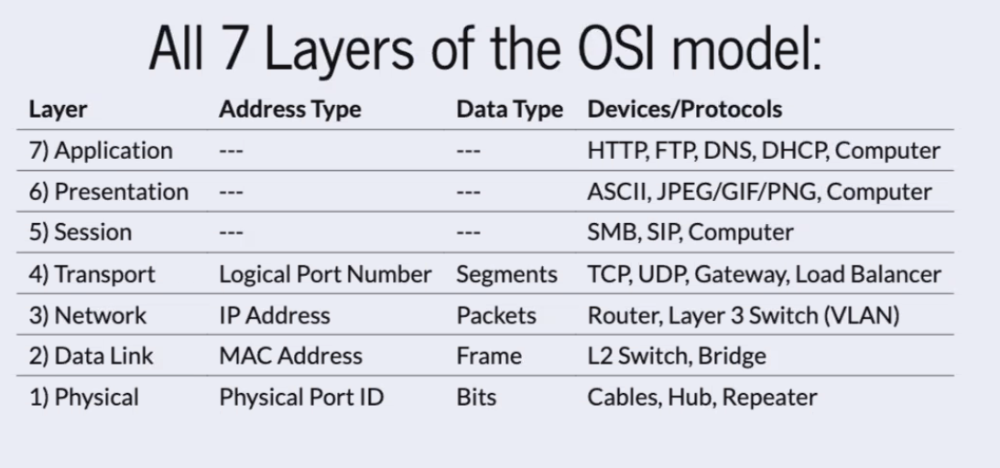

# Class 01 Lecture Notes

## Network Traffic Analysis

### OSI Layers

### Packet Capture

**packet:** A unit of data transmitted over a network. Contains both the actual data being sent and control infomration needed for its successful transmission and delivery to destination.

Why perform _packet analysis_?

- **Network Troubleshooting:** Packet analysis helps in diagnosing network problems, such as slow speeds, connectivity issues, or packet loss.
- **Security Analysis:** Allow sysadims to detect unusual patterns that may indicate a security breach, such as unauthorized data exfiltration.
- **Performance Optimization:** Analyzing packets can reveal inefficiencies in network protocols or configurations, enabling optimization for better performance.
- **Compliance and Monitoring:** Ensuring that network communication adheres to org or legal policies and standards.

What is _packet sniffing?_

- _Packet sniffing_ is the process of intercepting and logging traffic that passes over a digital network. It is done using software or hardware tools (packet sniffers) that capture each packet to decode and analyze its content.
- This method can be used for legitimiate purposes, like network management and security, and illegitimate purposes, such as eavesdropping on network traffic for malicious reasons.
